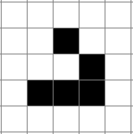
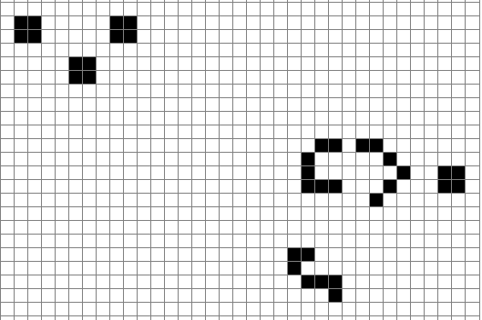
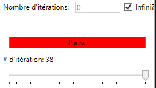

# Conway's Game of Life

## Description

Reproduction du jeu de la vie de Conway

## Installation
Télécharger l'installateur ici: [Latest Release](https://github.com/kwidz/AndrewSoloProject/releases/tag/v1.0-release)

1) Lancez l'installateur.
2) Cliquez sur `Installer`.  

  

3) Une fois l'installation terminée, cliquez sur `Terminer`  

## Usage
Lancement:  

Vous pouvez définir une taille custom pour la grille. Voici un exemple d'une grille 15x15:

Si les tailles sont correcte, vous pourrez cliquer sur `Create Canvas`.
Ceci créera un canvas, comme ceci:

### Dans l'interface:
#### Le Canvas
Dans la grille vous pouvez cliquer sur un carré pour soit la rendre:
- Vivante: 
- Morte: 

#### Les boutons pour générer les formes
Les 4 premiers boutons sous l'entête `Générer une forme` permettent de charger dans
la grille une forme pré-définie, ainsi qu'une 'forme' aléatoire. Chaque forme à une taille
minimum, sinon quoi le bouton sera grisé puisqu'elle ne rentre pas dans la grille.

##### Forme 1 (Glider)
**Taille**: 3x3  

**Forme**:  
  

##### Forme 2 (Blinker)
**Taille**: 3x3  

**Forme**:  
  

##### Forme 3 (Gun)
**Taille**: 33x21  

**Forme**:  
  

##### Aléatoire
**Taille**: Aucune  

**Forme**: Créee un canvas aléatoire. Voici un exemple:

#### Charger une forme
Sélectionnez un fichier de type .gol pour la charger dans la grille.
La grille se redimensionnera pour accommoder la taille de la forme.
#### Enregistrer une forme
Donnez un nom a votre fichier pour l'enregistrer!
#### Contrôles d'itérations
Vous pouvez entrer le nombre d'itérations souhaité ou cocher la case `Infini?`.
Le bouton `Démarrer` permet de commencer la simulation, et fait aussi apparaitre
les boutons `Continuer` et `Pause`. 
  

Quand on fait `Pause`, le bouton `Itérer` apparait.  

  

En dessous vous voyez le numéro de la dernière itération.
#### Contrôle de vitesse
Vous pouvez ralentir (1s par itération) ou accélérer (0.05s par itération) la simulation.

